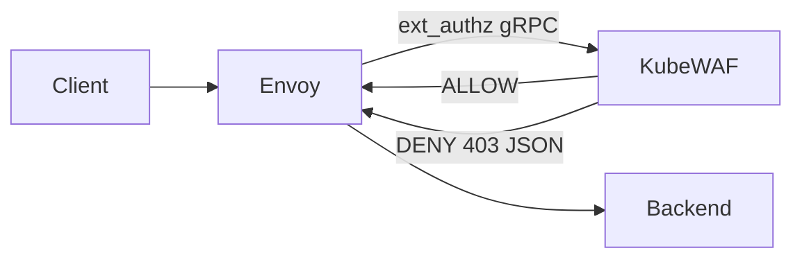

# kubeWAF
A Kubernetes-native, high-performance, modular L7 firewall for Gateway API traffic using Envoy Gateway external authorization and a YAML policy file.

## High Level Architecture

```mermaid
flowchart LR
  Client --> Envoy
  Envoy -->|ext_authz gRPC| KubeWAF
  KubeWAF -->|ALLOW| Envoy
  Envoy --> Backend
  KubeWAF -->|DENY 403 JSON| Envoy
```
