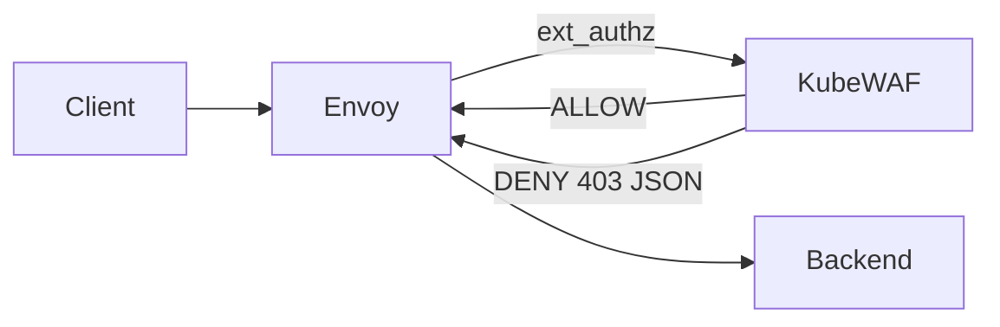

# Feature Specification — Envoy-KubeWAF 

---

## 1. Overview

A Kubernetes-native, high-performance, modular L7 firewall for Gateway API traffic using Envoy Gateway external authorization (ext-auth) and a mounted YAML policy file.

**Scope constraint:**  
Supports **HTTP/HTTPS (L7) only** via Envoy Gateway `SecurityPolicy` + `extAuth`. No L4/TCP/UDP support.

---

## 2. Goals & Non-Goals

### Goals

- Protect **Gateway API HTTPRoute/Gateway L7 traffic**
- Integrate with **Envoy Gateway ext-auth**
- Provide a **single Policy YAML configuration file**
- Support modular built-in security controls
- Return **403 with structured JSON reason**
- Add **≤ 5ms p95 latency at 3000 RPS**
- Provide structured logs and Prometheus metrics
- Simple operational model (no controller/operator)

### Non-Goals

- No L4 (TCP/UDP/TLSRoute) enforcement
- No Kubernetes CRD/operator
- No multi-tenancy separation
- No dynamic plugin system
- No CAPTCHA/challenge flows

---

## 3. Target Users

- Platform engineers running Envoy Gateway
- Security engineers defining baseline policies
- SREs monitoring security metrics

---

## 4. Success Metrics / KPIs

|Category|Target|
|---|---|
|Added Latency|≤ 5ms p95|
|Decision Engine Time|≤ 2ms p95|
|Throughput|3000 RPS sustained|
|Availability|≥ 99.9%|
|Decision Logging Coverage|≥ 99.99% of denies contain module + rule ID|

---

## 5. Functional Requirements

### Core System

| ID   | Description                                             | Priority | Acceptance Criteria                                                |
| ---- | ------------------------------------------------------- | -------- | ------------------------------------------------------------------ |
| FR-1 | Load firewall policy from mounted YAML file (ConfigMap) | High     | Policy loads at startup; reload supported via SIGHUP or file watch |
| FR-2 | Integrate with Envoy Gateway ext-auth (gRPC preferred)  | High     | Envoy calls service; allow/deny enforced                           |
| FR-3 | Attach to specific hosts defined in policy              | High     | Only configured hosts are evaluated                                |
| FR-4 | Return structured JSON deny reason                      | High     | 403 body contains `blockedBy`, `ruleId`, `reason`                  |
| FR-5 | Shadow mode support                                     | Medium   | Requests logged but not denied                                     |

---

### Required Security Modules

All modules are **built-in** and executed in deterministic order.

---

### 1️⃣ Protocol Enforcement Module

|ID|Description|Priority|Acceptance Criteria|
|---|---|---|---|
|FR-10|Enforce allowed HTTP methods|High|Non-allowed method → 403|
|FR-11|Reject disallowed methods (e.g., TRACE)|High|TRACE returns 403|
|FR-12|Enforce strict Host header validation|High|Host mismatch denied|
|FR-13|Enforce content-type allowlist|High|Invalid/missing type denied|
|FR-14|Header size/count limits|High|Exceed limits → deny|

---

### 2️⃣ GeoIP Blocking

|ID|Description|Priority|
|---|---|---|
|FR-20|GeoIP lookup via X-Forwarded-For|High|
|FR-21|Configurable trusted proxy hops|High|
|FR-22|Country allow/deny lists|High|

---

### 3️⃣ Threat Signature Matching

Fast detection of injection patterns.

|ID|Description|Priority|
|---|---|---|
|FR-30|SQL injection detection|High|
|FR-31|XSS pattern detection|High|
|FR-32|Command injection patterns|High|
|FR-33|Regex + token-based signatures|High|
|FR-34|Rule ID per signature|High|

---

### 4️⃣ Path Traversal & Normalization Guard

|ID|Description|Priority|
|---|---|---|
|FR-40|Normalize path before inspection|High|
|FR-41|Detect `../` traversal attempts|High|
|FR-42|Detect double-encoding attacks|High|
|FR-43|Reject invalid URL encoding|High|

---

### 5️⃣ SSRF Guardrails

Heuristic protection for common SSRF vectors.

|ID|Description|Priority|
|---|---|---|
|FR-50|Detect internal IP literals in parameters|High|
|FR-51|Detect localhost/metadata endpoints|High|
|FR-52|Configurable protected CIDR ranges|High|

---

### 6️⃣ Scanner / Bot Heuristics

Lightweight detection of malicious automation.

|ID|Description|Priority|
|---|---|---|
|FR-60|Suspicious User-Agent detection|High|
|FR-61|Missing common browser headers heuristic|Medium|
|FR-62|Known scanner fingerprints|High|
|FR-63|Optional ASN / TOR detection (future)|Low|

---

### 7️⃣ Request Body Inspection

|ID|Description|Priority|
|---|---|---|
|FR-70|Inspect JSON bodies|High|
|FR-71|Inspect form-data bodies|High|
|FR-72|Configurable max inspection size|High|
|FR-73|Hard cap body size|High|

---

## 6. Non-Functional Requirements

### Performance

- NFR-1: ≤ 5ms p95 added latency
- NFR-2: ≤ 2ms internal processing
- NFR-3: Default inspect limit 64KB
- NFR-4: Hard cap 256KB

### Availability

- NFR-5: ≥ 99.9% uptime
- NFR-6: Fail-closed by default (configurable)

### Security

- NFR-7: mTLS between Envoy and KubeWAF
- NFR-8: XFF trust validation
- NFR-9: Config validation at startup

### Observability

- NFR-10: Prometheus metrics endpoint
- NFR-11: Structured JSON logs
- NFR-12: Per-module latency metrics

---

## 7. User Flow

1. Operator deploys KubeWAF.
2. ConfigMap with `policy.yaml` mounted into pod.
3. Envoy Gateway configured with `SecurityPolicy` referencing ext-auth service.
4. Requests flow:
    
    - Envoy → ext-auth → module pipeline
    - ALLOW → upstream
    - DENY → 403 with reason JSON

---

## 8. Dependencies

- Envoy Gateway with ext-auth support
- GeoIP database
- Prometheus (optional but recommended)

---

## 9. Risks & Mitigations

|Risk|Mitigation|
|---|---|
|Latency spike from regex|Precompiled RE2; Aho-Corasick|
|XFF spoofing|Trusted hops config|
|Large body DoS|Strict size caps|
|False positives|Shadow mode|

---

## 10. Timeline

MVP (8–10 weeks total):

1. Core ext-auth service (3 weeks)
2. Protocol + GeoIP modules (2 weeks)
3. Signature + traversal + SSRF modules (3 weeks)
4. Performance tuning + observability (2 weeks)

---

# Engineering Design Document — KubeWAF 

---

## 1. High-Level Architecture



**Control Plane Model**

- Static ConfigMap → mounted into pod
- File watcher reloads policy
    

---

## 2. Component Descriptions

|Component|Responsibility|Tech|
|---|---|---|
|Envoy Gateway|L7 routing + ext-auth integration|Envoy|
|KubeWAF Service|ext_authz gRPC implementation|Go (preferred)|
|Policy Loader|Parse + validate YAML|Go|
|Decision Engine|Execute module chain|In-memory compiled structures|
|Module Library|Built-in modules|Native Go|

---

## 3. Policy Schema (ConfigMap Mounted)

Example:

```yaml
hosts:
  - api.example.com
    allowedMethods: ["GET","POST"]
    protocolEnforcement:
      allowedContentTypes:
        - application/json
    geoip:
      trustedHops: 1
      allowCountries: []
      denyCountries: ["CN","RU"]
    signatures:
      - id: SQLI-1
        pattern: "(?i)union\\s+select"
    pathTraversalGuard:
      enabled: true
    ssrf:
      blockedCidrs:
        - 169.254.0.0/16
        - 10.0.0.0/8
    botDetection:
      blockedUserAgents:
        - "sqlmap"
        - "nikto"
    bodyInspection:
      maxInspectBytes: 65536
```

---

## 4. API / Interface Design

### Envoy → KubeWAF

- ext_authz API
    
- Receives:
    - Headers    
    - Method
    - Path
    - Query
    - Body (bounded)

### Response

**Allow**

```
OK
```

**Deny**

```json
{
  "blockedBy": "threat-signature",
  "ruleId": "SQLI-1",
  "reason": "Matched SQL injection signature"
}
```

---

## 5. Module Execution Order

Performance-first ordering:

1. Protocol Enforcement
2. Header/size limits
3. Path normalization & traversal guard
4. GeoIP
5. SSRF heuristics
6. Bot detection
7. Body inspection
8. Threat signature matching

Short-circuit on first deny.

---

## 6. Scalability & Capacity Planning

### Deployment Options

**Option A — Per Gateway Pod Sidecar (Preferred)**

- Lowest latency
- 1:1 scaling with Envoy

**Option B — Shared Deployment**

- Simpler ops
- HPA based on CPU/QPS

### Performance Strategy

- RE2-safe regex
- Aho-Corasick multi-pattern matcher
- Zero-copy header inspection
- Bounded body buffering
- Immutable compiled policy objects

---

## 7. Security

- mTLS enforced
- Header redaction in logs
- Hardened container 

---

## 8. Observability

### Metrics

- `kubewaf_requests_total`
- `kubewaf_denied_total{module}`
- `kubewaf_module_latency_ms`
- `kubewaf_policy_reload_total`
- `kubewaf_errors_total`

### Logs

Structured JSON:

```
{
  "host": "api.example.com",
  "path": "/v1/login",
  "decision": "DENY",
  "module": "ssrf",
  "ruleId": "SSRF-2",
  "latency_ms": 1.4
}
```

---

## 9. Performance Benchmarks

Target profile:

- 3000 RPS
- p95 ≤ 5ms
- CPU ≤ 1 core per 1500 RPS (estimated baseline)
- Memory ~150MB (GeoIP DB + matcher tables)

---

## 10. Trade-offs

|Decision|Rationale|
|---|---|
|No CRD|Simpler deployment model|
|L7 only|Cleaner integration & lower complexity|
|Built-in modules only|Deterministic performance|
|gRPC ext-auth|Lower latency than HTTP|

---

## 11. Future Roadmap

- Policy validation CLI tool
- Prebuilt “baseline” and “strict” configs
- Anomaly scoring mode
- WASM extension support
- UI dashboard
